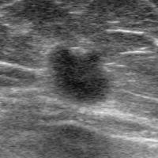
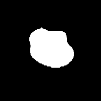
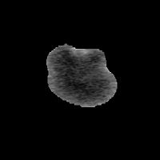
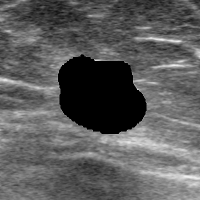
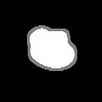
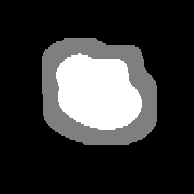
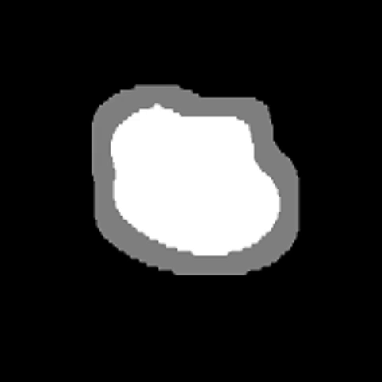

## Automatic Trimap Generator ##

#### Keywords: Alpha Compositioning,Trimap ####
#### 關鍵: Alpha合成、三分圖 ####
#### キーワード:アルファチャンネル、マスク画像 ####

**Introduction/簡介/紹介:** 
<ul>
<li/>In image matting, trimap has become an integral part of separating foreground from its background. Trimap attempts to separate foreground and background using unknown region to estimate specific regions in the image
<li/> Mathematically, an image can be represented by the following equation:
</ul>
<p align="center">
<a href="https://www.codecogs.com/eqnedit.php?latex=I_p&space;=&space;\alpha_p&space;F_p&space;&plus;&space;(1-\alpha_p)B_p;\,&space;\alpha_p&space;\in&space;[0,1]" target="_blank"></a>
</p>
In this equation, <i>I<sub>p</sub></i> denotes the entire image, <i>F<sub>p</sub></i> denotes a defnite foreground, and <i>B<sub>p</sub></i> denotes a definite background. <br/> 
On the other hand, <a href="https://www.codecogs.com/eqnedit.php?latex=\alpha_p" target="_blank"></a> is an alpha matte constants with a range value between 0 and 1. An <a href="https://www.codecogs.com/eqnedit.php?latex=\alpha_p" target="_blank"></a> value of 0 indicates that the pixel belongs to a foreground; whereas an <a href="https://www.codecogs.com/eqnedit.php?latex=\alpha_p" target="_blank"></a> value of 1 indicates otherwise. Any <a href="https://www.codecogs.com/eqnedit.php?latex=\alpha_p" target="_blank"></a> value in between means a mixed pixel. <br /><br />

<b>Description/概念/概要: </b> 
<ul>
  <li/>Generate a trimap (foreground, background, and unknown regions) from an input of binary (mask) image.
  <li/>Foreground has a pixel value of 255; background has a pixel value of 0; and unknown has a pixel value of 127.
  <li/>In this example, the trimap is generated by extending a binary image of a previously segmented tumor. 
  <li/>The binary image consists of two parts: foreground (white) which is the tumor and background (black) which is the surrounding region
  <li/>Keep in mind that the unknown region is simply an approximation rather than an exact delineation. Therefore, matting process becomes a crucial key to extract foreground images with exact precision (<b>Deep Image Matting</b> anyone?)
  <li />All binary images in this repository were generated from <b>U-Net</b> with a <b> Jaccard's Coefficient </b> of 0.94 (out of 1), indicating a high agreement between the physician's denoted ground truth and segmented mask images
  <li />Image erosion may anticipate any overestimating foreground issue
</ul>
<br /><b>Input/輸入/入力 :</b> a binary image (from a segmented lesion)
<br /><b>Output/輸出/出力:</b> a trimap with unknown region (gray) from tumor dilation
<hr />

<b>January 06, 2019: </b> <br/>

- [X] Enable image erosion option
- [X] Recursive function of the module that can handle multiple input images

<b>December 30, 2018: </b> <br/>

- [x] Online interactive tutorial using Jupyter Notebook
- [x] Separate module: **trimap_module.py**

---
<b> TO DO: </b> <br/>
- [ ] **Unit Testing**: (1) prevent erosion from diminishing the entire foreground, and (2) reject non-binary images
- [ ] **Error Handler**: only accepts binary image
- [ ] **Interactive Module**: Widgets
- [ ] **Python Documentation**: Doxygen

---
## Examples ##

**1 Dilating the binary image** <br/>
```python
name    = "./image/samples/seg_image.png";
size    = 10; # how many pixel extension do you want to dilate
number  = 1;  # numbering purpose (in case more than one image are available)
bin_img = cv2.imread(name, cv2.IMREAD_GRAYSCALE)
trimap_generate(bin_img, name, size, number, erosion=False)
```
|**FULL IMAGE**| **MASK IMAGE**|**FOREGROUND**| **BACKGROUND**|
|:----------:|:----------:|:----------:|:----------:|
||  |   |  

|**BINARY IMAGE**|**TRIMAP (10 PX)**|**TRIMAP (20 PX)**|**TRIMAP (30 PX)**|
|:----------:|:----------:|:----------:|:----------:|
||||| 

**2 Impact of Eroding Foreground** <br/>
The illustration starts with zero erosion; followed with one, three, five, until eleven iterations (an increment of two). <br />

<p align="center">

</p><br />

## References/參考/外部参考 ##
1. Vikas Gupta and Shanmuganathan Raman. (2017). "Automatic Trimap Generation for Image Matting". Indian Institute of Technology, Gandhinagar, IND [download](https://arxiv.org/pdf/1707.00333.pdf)
2. Olivier Juan and Reanud Keriven. (2005). "Trimap Segmentation for Fast and User-Friendly Alpha Matting". FRA [download](http://imagine.enpc.fr/publications/papers/05vlsm_c.pdf)
